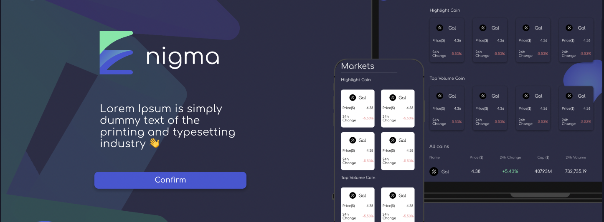

<h1 align=center>LipetskDigital Hackaton Code</h1>

Этот репозиторий содержит в себе код для хакатона по созданию крипто рынка
валют. Этот репозиторий не доделан по одной причине - Open-Source Svelte'кита.

Метод использования Cookie файла раньше:

```javascript
export async function load({session}) {
    if (!session?.result) {
        return {
            status: 302,
            redirect: "/signup"
        }
    }
    return {
        status: 200
    };
};
```

Теперь

```javascript
document.cookie
```

Из-за быстрой смены версий прозошло неожиданная накладка. Поэтому этот
репозиторий остаётся только как напоминание о подобных ситуациях

## Разработка
-------------

Доделать данное приложение можно

### Запуск

```bash
git clone ... # url
cd frontend;
npm i -g pouchdb-server; # База данных, в формате сервера
npm i;
pouchdb-server --port 5353 | npm run dev;
```
